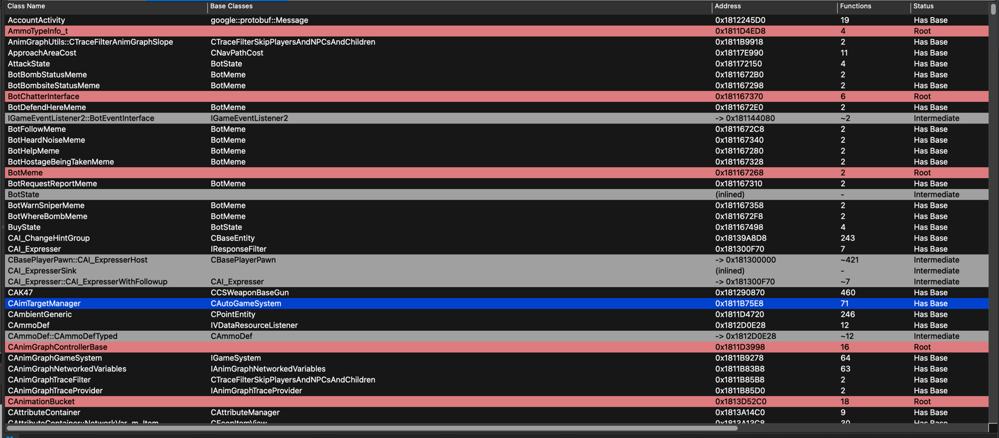
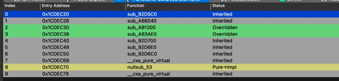
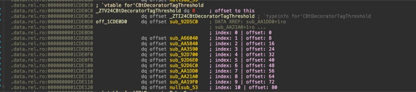
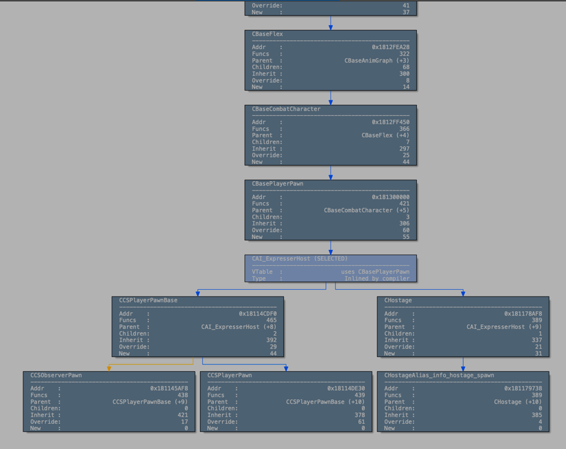
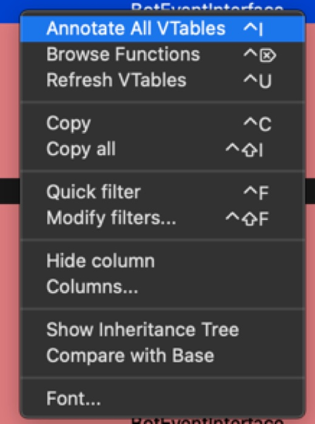
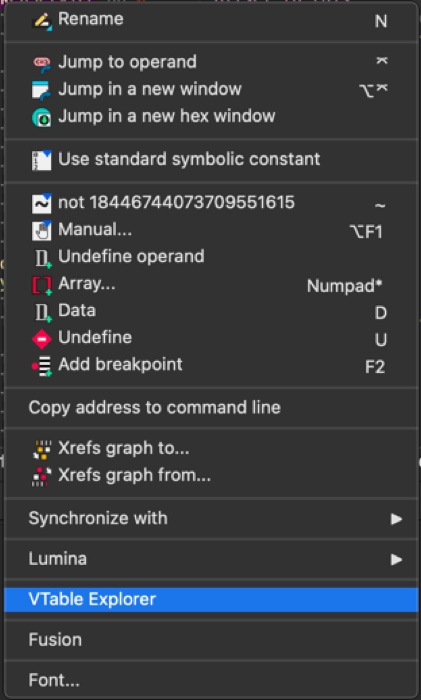

# VTable Explorer for IDA Pro

Professional C++ virtual table analysis plugin for IDA Pro 9.x with complete cross-platform support.

Automatic vtable detection, inheritance analysis, and function override tracking for reverse engineering compiled C++ binaries.

---

## Features

**Core Capabilities**

- Automatic vtable detection (GCC/MSVC symbol patterns)
- Class name extraction and demangling
- Virtual function indexing with byte offsets
- Inheritance hierarchy detection via RTTI parsing
- Function override comparison between base and derived classes
- Pure virtual and abstract class identification
- Interactive inheritance graph visualization
- Batch annotation with progress tracking

**Platform Support**

- IDA Pro 9.x (modern SDK)
- Windows x64
- Linux x64/ARM64
- macOS Intel/Apple Silicon

**Integration**

- Native IDA chooser interface
- Context menu integration
- Keyboard shortcuts (Ctrl+Shift+V / Cmd+Shift+V)
- Searchable vtable browser with 2000+ entry support

---

## Installation

**Download** binary for your platform from releases

**Copy** to IDA plugins directory:

```
Windows:  C:\Program Files\IDA Pro 9.x\plugins\vtable64-windows-x64.dll
Linux:    /opt/ida-pro/plugins/vtable64-linux-{x64,arm64}.so
macOS:    /Applications/IDA Pro 9.x.app/Contents/MacOS/plugins/vtable64-macos-{arm64,x64}.dylib
```

**Restart** IDA Pro

---

## Quick Start

**Open Plugin**
- Keyboard: `Ctrl+Shift+V` (Win/Linux) or `Cmd+Shift+V` (macOS)
- Menu: `Edit → Plugins → VTableExplorer`
- Context menu: Right-click in disassembly

**Basic Workflow**

1. Open plugin to see all detected vtables
2. Search by typing class name
3. Press `Enter` to annotate and jump to vtable
4. Press `Del` to browse virtual functions
5. Press `Edit` to compare with base class (shows overrides only)
6. Press `Ins` to batch annotate all vtables

**Inheritance Analysis**

- Right-click vtable → "Show Inheritance Tree" for visual class hierarchy
- Override comparison highlights changes: inherited (gray), overridden (green), new (blue)
- Toggle "Show All" / "Hide Inherited" to filter results

---

## Use Cases

**Runtime Hooking**

```cpp
// VTable Explorer shows: index: 42 | offset: 336
void** vtable = *(void***)pObject;
auto OnTakeDamage = (TakeDamageFn)vtable[42];  // exact index from annotation
```

**Reverse Engineering**

- Locate player/entity vtables by class name search
- Map virtual function hierarchies across inheritance
- Identify which methods derived classes override
- Track pure virtual functions and abstract classes

**Code Analysis**

- Understand polymorphic behavior patterns
- Visualize inheritance relationships
- Compare vtable implementations across class families
- Document virtual function indices for hooking frameworks

---

## Screenshots

<p align="center">
  
  <br/>
  <em>Searchable vtable browser with inheritance and pure virtual detection</em>
</p>

<p align="center">
  
  <br/>
  <em>Virtual function browser with index and override status</em>
</p>

<p align="center">
  
  <br/>
  <em>Annotated vtable with function indices and byte offsets</em>
</p>

<p align="center">
  
  <br/>
  <em>Interactive class hierarchy visualization with override statistics</em>
</p>

<p align="center">
  
  <br/>
  <em>VTable Explorer context menu with Show Inheritance Tree and Compare with Base</em>
</p>

<p align="center">
  
  <br/>
  <em>IDA disassembly view with VTable Explorer integration</em>
</p>

---

## How It Works

**Symbol Detection**

VTable Explorer scans for platform-specific vtable symbols:

```
Linux/GCC:     _ZTV6Player  → vtable for 'Player'
Windows/MSVC:  ??_7Player@@6B@  → Player::`vftable'
```

**RTTI Parsing**

Automatic Runtime Type Information parsing extracts:
- Base class relationships
- Multiple inheritance detection
- Virtual inheritance identification
- Class hierarchy structure

**Annotation Example**

```asm
.data:1CDB018 _ZTV6CCSBot:              ; vtable for 'CCSBot'
.data:1CDB020   dq offset _ZTI6CCSBot  ; typeinfo (RTTI metadata)
.data:1CDB028   dq offset sub_A23D00   ; index: 0 | offset: 0
.data:1CDB030   dq offset sub_A237B0   ; index: 1 | offset: 8
.data:1CDB038   dq offset sub_A283C0   ; index: 2 | offset: 16
```

**Smart Offset Detection**

- Linux/GCC: Auto-detects RTTI metadata offset (typically +2 qwords)
- Windows/MSVC: Starts at vtable base (offset 0)
- Boundary detection stops at next vtable or invalid pointers
- Tolerates up to 5 consecutive invalid entries for robust scanning

---

## Building from Source

**Prerequisites**

- IDA SDK extracted to `sdk/` directory
- Docker (for Linux/macOS builds)
- LLVM/Clang (for Windows cross-compile)

**Build Commands**

```bash
# Linux + macOS (via Docker)
make build

# Windows cross-compile (requires llvm + xwin)
make build-windows

# All platforms
make build-all
```

**Output**

Binaries in `release/`:
- `vtable64-linux-x64.so`
- `vtable64-linux-arm64.so`
- `vtable64-macos-arm64.dylib`
- `vtable64-macos-x64.dylib`
- `vtable64-windows-x64.dll`

See [docker/README.md](docker/README.md) for build details.

---

## Technical Details

**Detection Patterns**

- `_ZTV*` - Linux/GCC vtable symbols
- `??_7*@@6B@` - Windows/MSVC vftable symbols
- `*vftable*`, `*vtbl*` - Generic fallback patterns

**Class Name Extraction**

- IDA demangler integration
- Itanium C++ ABI name parser fallback
- Namespace and template support

**Pure Virtual Detection**

- `__cxa_pure_virtual` (GCC)
- `_purecall`, `purevirt` (MSVC)
- Abstract classes marked in chooser

**Annotation Strategy**

- 0-based indexing (C++ standard)
- Index + byte offset comments
- RTTI metadata skipping
- Enhanced function detection (trusts IDA auto-analysis)

**Inheritance Analysis**

- GCC: `__class_type_info` parsing
- MSVC: `_RTTICompleteObjectLocator` parsing
- Multi-level hierarchy traversal
- Virtual inheritance detection

---

## Credits

**Original concept** by [KillStr3aK](https://github.com/KillStr3aK) - Python vtable script

**Build system** adapted from [IDA-Fusion-Enhanced](https://github.com/K4ryuu/IDA-Fusion-Enhanced)

---

## License

MIT License - Free for personal and commercial use
